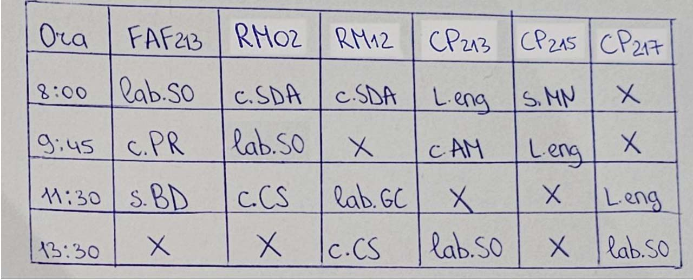
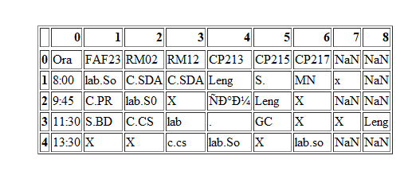
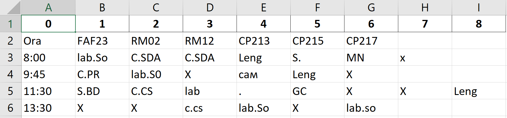

# Perfect Pixel
A OCR Handwriting Recognition web app that lets you upload an image of a handwritten text and converts it into a digital text format, which is excel (.xlsx). 

## Dependencies
- Google Cloud Vision 
- React
- Python
  - Flask
  - wkhtmltoimage

## Usage
1. Clone the repository / Download the zip file
```
git clone git@github.com:Sufferal/Schedule-Management.git
```
2. Start the React App
```
npm start
```
3. Start Flask Server
```
python3 app.py
```
4. Open the browser and go to http://localhost:3000/

## Examples
### Initial input


### Preview (before conversion to excel)


### Output



## References
- [Handwriting Recognition](https://www.kaggle.com/datasets/landlord/handwriting-recognition)
- [OCR](https://web.archive.org/web/20160415060125/https://dev.havenondemand.com/apis/ocrdocument)
- [Google Cloud Vision](https://cloud.google.com/vision/docs/ocr)